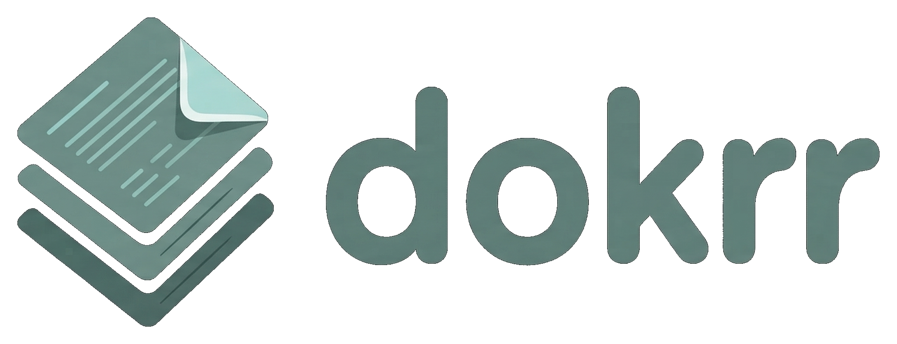

<p align="center">
  
</p>

<p align="center">
  A distraction-free reader for markdown documents.<br>
  Built for reviewing research docs, brainstorming notes, and knowledge bases generated by AI coding tools.
</p>

## Features

- **Drag-and-drop** or file picker to load folders of `.md` files
- **Dark theme** — "Ink & Paper" aesthetic with teal accents
- **Sidebar navigation** — collapsible tree view with nested folder support
- **Syntax highlighting** — 30+ languages via Shiki (vitesse-dark theme)
- **Zoom controls** — 1x, 1.25x, 1.5x presets + slider
- **Scroll memory** — remembers scroll position per document, survives reload
- **Auto-reload** — detects file changes on disk every 2 seconds
- **Session persistence** — IndexedDB stores your reading state across page reloads
- **Folder management** — add, remove, and reload folders independently
- **Fully client-side** — no backend, no data leaves your machine

## Quick Start

### Using Docker (recommended)

```bash
docker compose up
```

Open [http://localhost:8080](http://localhost:8080)

### From source

```bash
npm install
npm run dev
```

Open [http://localhost:3000](http://localhost:3000)

### Static build

```bash
npm run generate
```

Serve the contents of `.output/public/` with any static file server.

## Browser Support

Full functionality requires a **Chromium-based browser** (Chrome, Edge, Brave, Arc). The File System Access API — used for directory picking and auto-reload — is not available in Firefox or Safari. A fallback file input is provided with reduced functionality.

## Use Case

Dokrr was built for a specific workflow: reviewing markdown documents generated during research and brainstorming sessions with AI coding tools like Claude Code. When you generate dozens of `.md` files during a project, you need a clean, focused reader — not a code editor, not a notes app.

## Tech Stack

- [Nuxt 4](https://nuxt.com) (SPA mode)
- [Vue 3](https://vuejs.org) + [Pinia](https://pinia.vuejs.org)
- [Tailwind CSS](https://tailwindcss.com) + Typography plugin
- [markdown-it](https://github.com/markdown-it/markdown-it) + [Shiki](https://shiki.style)
- File System Access API
- IndexedDB for persistence

## Development

```bash
npm run dev          # Start dev server
npm run build        # Build for production (Node server)
npm run generate     # Generate static site
npm run preview      # Preview production build
```

## License

[MIT](LICENSE)
